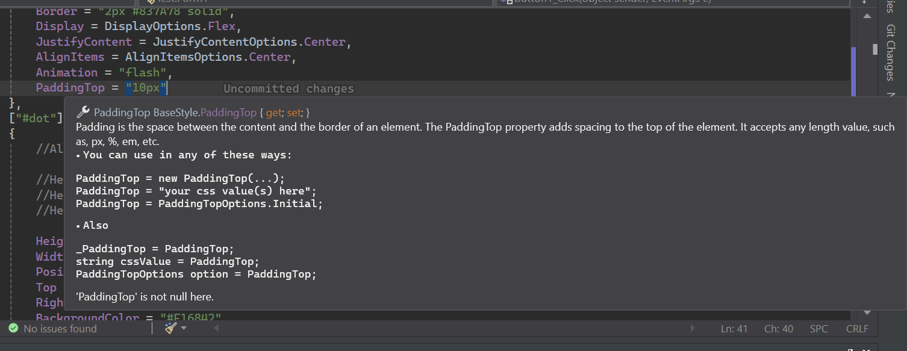
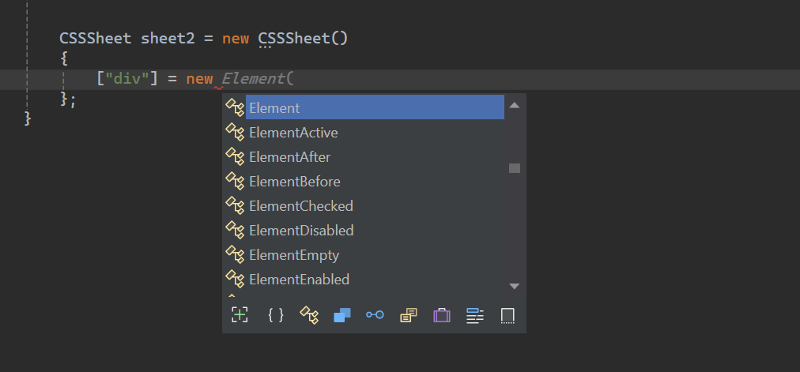

# Stylesheet.Net

**Stylesheet.Net** is a cross-platform .NET library designed for C#, VB.NET, and F# developers. It enables developers to write CSS styles directly in their code, eliminating the need for external stylesheet files. **Stylesheet.Net** provides pre-written implementations for all CSS properties, at-rules, keywords, and other elements, eliminating the need for additional dependencies.

It allows you to export both minified and unminified css.

**Stylesheet.Net** has extensive intellisense documentations.



## 

## Quick Start

We can implement the following CSS styling logic within our C# code using **Stylesheet.Net**.

##### CSS

```css
@charset "UTF-8";
@font-face {
    font-family: lilitaone-regular;
    src: url('font/lilitaone-regular.ttf');
}
:root{
        all: unset;
        --color: blue;
}
.head .account{
        height: 40px !important;
        width: 40px !important;
        position: absolute;
        top: 12px;
        left: 15px;
        border-radius: 20px;
        border: 2px #837A78 solid;
        display: flex;
        justify-content: center;
        align-items: center;
        -webkit-animation: flash;
        -moz-animation: flash;
        animation: flash;
}
#dot:hover{
        height: 10px;
        width: 10px;
        position: absolute;
        top: 16px;
        right: 13px;
        background-color: #F16842;
        border-radius: 5px;
        display: block;
}
@Keyframes flash{
0%, 50%, to   {
        opacity: 1;

}
55%   {
        opacity: 0.5;

}
25%, 75%   {
        opacity: 0;

}
}
@media (min-width: 0px) and (max-width: 319px){
a[target="_blank"]{
        position: absolute;
        top: 20px;
        left: 0;
        z-index: 99;
}
}
```

##### C#

```csharp
  using StylesheetNET;

  CSSSheet sheet1 = new CSSSheet()
  {
      Charset = "UTF-8",
      Root = new Root()
      {
          All = AllOptions.Unset,
          ["--color"] = "blue"
      },

      [".head .account"] = new Element()
      {
          //Also u can write them this way too

          //Height = new Height("10px"),
          //Height = new Height(HeightOptions.Auto)
          //Height = HeightOptions.Auto;

          Height = "40px !important",
          Width = "40px !important",
          Position = PositionOptions.Absolute,
          Top = "12px",
          Left = "15px",
          BorderRadius = "20px",
          Border = "2px #837A78 solid",
          Display = DisplayOptions.Flex,
          JustifyContent = JustifyContentOptions.Center,
          AlignItems = AlignItemsOptions.Center,
          Animation = "flash"
      },
      ["#dot"] = new ElementHover()
      {
          Height = "10px",
          Width = "10px",
          Position = PositionOptions.Absolute,
          Top = "16px",
          Right = "13px",
          BackgroundColor = "#F16842",
          BorderRadius = "5px",
          Display = DisplayOptions.Block

      },

      [AtRuleType.MediaQuery] = new MediaQuery(new AtRule().MinWidth("0px").And.MaxWidth("319px"))
      {
          ["a[target=\"_blank\"]"] = new Element()
          {
              Position = PositionOptions.Absolute,
              Top = "20px",
              Left = "0",
              ZIndex = "99"
          }
      },

      [AtRuleType.Keyframes] = new Keyframes("flash")
      {
          ["0%, 50%, to"] = new Keyframe()
          {
              Opacity = "1"
          },
          ["55%"] = new Keyframe()
          {
              Opacity = "0.5"
          },
          ["25%, 75%"] = new Keyframe()
          {
              Opacity = "0"
          }
      }
  };

  sheet.AddFontFace("lilitaone-regular", "font/lilitaone-regular.ttf");
```

## Export CSS

There are several ways to export your css from **Stylesheet.Net**.

##### C#

```csharp
  string unminified_css = sheet1;
  //or
  string unminified_css = sheet1.ToString();
  string minified_css = sheet1.ToString(true);
  //or
  string unminified_css = sheet1.GenerateCss();
  string minified_css = sheet1.GenerateCss(true);
```

## Documentation

**Stylesheet.Net** is organized into several core components, each providing specific functionalities for styling elements in your requirements.

- **Elements:** Represent the HTML elements style selectors you want to style, such as `div`, `span`, `h1 `, `id`, `class`, `Attribute `etc.
- **Pseudos:** Provide styling based on element states or interactions, including common pseudo-classes like `:hover`, `:focus`, and pseudo-elements like `::before` and `::after`. **All element and class pseudos are included**.
- **At-rules:** Allow for defining custom styles or behavior using directives like `@keyframes` for animations, `@media` for responsive layouts and `@import` and `@layer` for including external styles, and others.

### Element

Represents the HTML element style selector you want to style, such as `div`, `span`, `h1` , `id`, `class`, `Attribute` etc. **It houses all the element selector properties.**

##### css

```css
div {
    height: 10px;
    width: 10px;
    position: absolute;
    top: 16px;
    right: 13px;
    background-color: #F16842;
    border-radius: 5px;
    display: block;
}
```

##### C#

```csharp
  CSSSheet sheet = new CSSSheet()
  {
   ["div"] = new Element()
   {
      Height = "10px",
      Width = "10px",
      Position = PositionOptions.Absolute,
      Top = "16px",
      Right = "13px",
      BackgroundColor = "#F16842",
      BorderRadius = "5px",
      Display = DisplayOptions.Block

   }
  }
```

**Styleysheet.NET** also allows you to add custom properties.

##### C#

```csharp
 CSSSheet sheet = new CSSSheet()
  {
   ["div"] = new Element()
   {
      Height = "10px",
      //Width = "10px",

      ["width"] = "10px",
      ["my_custom_property"] = "some css values"
   }
  }
```

> Almost all properties are actually class objects that implicitly accept string and thier specific Enum options.
> 
> **Each property can be written in four ways.**
> 
> Example:
> 
> ```csharp
>  Height = new Height("10px")
>  Height = "10px"
>  Height = new Height(HeightOptions.Auto)
>  Height = HeightOptions.Auto;
> ```
> 
> All property enum options start with the name of their property then following by *`Options`*. E.g. `Height + Options = HeightOptions`.
> 
> All properties have Enum options that represent the predefined css keywords.

### Pseudos

**Stylesheet.Net** provides extensive support for CSS pseudo-classes and pseudo-elements, enabling you to define styles for elements based on their state or interaction.

> All pseudos start with *<u>Element</u>* then folowed by the <u>*pseudo type*</u>.
> 
> Example: `ElementHover`, `ElementAfter`, `ElementNthChild `etc.
> 
> 

**Example**

##### Css

```css
div:hover{
        color: red;
}
p::after{
        content: "Some contents";
        width: 50px;
        height: 75px;
}
.list:nth-child(3){
        background-color: blue;
}
.text:not(.sup, p){
        text-align
: right;
}
```

##### C#

```csharp
  CSSSheet sheet1 = new CSSSheet()
  {
      ["div"] = new ElementHover()
      {
          Color = "red"
      },
      ["p"] = new ElementAfter()
      {
          Content = "\"Some contents\"",
          Width = "50px",
          Height = "75px"
      },
      [".list"] = new ElementNthChild(3)
      {
          BackgroundColor = "blue"
      },
      [".text"] = new ElementNot(".sup, p")
      {
          TextAlign = TextAlignOptions.Right
      }
  };
```

## At-Rules

**At-Rules** Allow for defining custom styles or behavior using directives like `@keyframes` for animations, `@media` for responsive layouts and `@import` and `@layer` for including external styles, and others.

### Media queries

**Media queries** are an essential component of responsive web design. They enable the creation of dynamic layouts that adapt to different viewport sizes, ensuring an optimal user experience across various devices.

In **Stylesheet.NET** you can define media query in two ways:

1. **At-Rule builder**
   
   **At-Rule builder** helps you define custom rules using code chain pattern. 
   
   > **At-Rule builder** implicity converts to string, so you don't need to cast or convert to string.
   
   ```csharp
   string condition = new AtRule().Screen.And.MinWidth("0px").And.MaxWidth("319px");
   ```
   
   //Will give you:
   // screen and (min-width: 0px) and (max-width: 319px)

```
Let's create media query with **At-Rule builder**:

##### Css

```css
@media only screen and (max-width: 600px){
  div{
        width: 100%;
        height: 100%;
        display: grid;
    }
}
```

##### C#

```csharp
CSSSheet sheet1 = new CSSSheet()
{
    [AtRuleType.MediaQuery] = new MediaQuery(new AtRule().Only.Screen.And.MaxWidth("600px"))
    {
        ["div"] = new Element()
        {
            Width = "100%",
            Height = "100%",
            Display = DisplayOptions.Grid
        }
    }

};
```

> **At-Rule builder** has all Css rules implemented. You can chain them as you want with no limit in length.

2. **Custom css**

If you don't want to use the **At-Rule builder**, you can simply put your own css rules/conditions as string.

##### Css

```css
@media only screen and (max-width: 600px){
  div{
        width: 100%;
        height: 100%;
        display: grid;
    }
}
```

##### C#

```csharp
CSSSheet sheet1 = new CSSSheet()
{

    [AtRuleType.MediaQuery] = new MediaQuery("only screen and (max-width: 600px)")
    {
        ["div"] = new Element()
        {
            Width = "100%",
            Height = "100%",
            Display = DisplayOptions.Grid
        }
    }

};
```

> <mark>Don't add `@media` as the library adds that for you.</mark>

## Keyframes

The `@keyframes` CSS at-rule empowers developers to create complex animations by defining styles for specific points within the animation sequence.

**Stylesheet.NET** divides this into two, `Keyframes` and `Keyframe`.

A `Keyframes ` object is `class `that holds waypoints. A waypoint is single `Keyframe` object.

A `keyframe `in other hand is a single waypoint. A waypoint can be of any value that is `percent `or `from `and `to` or combination of these.

##### Css

```css
@Keyframes flash{
0%, 50%, to   {
        opacity: 1;

}
55%   {
        opacity: 0.5;

}
25%, 75%   {
        opacity: 0;

}
}
```

##### C#

```csharp
CSSSheet sheet1 = new CSSSheet()
{
    [AtRuleType.Keyframes] = new Keyframes("flash")
    {
        ["0%, 50%, to"] = new Keyframe()
        {
            Opacity = "1"
        },
        ["55%"] = new Keyframe()
        {
            Opacity = "0.5"
        },
        ["25%, 75%"] = new Keyframe()
        {
            Opacity = "0"
        }
    }
};
```

## Import

The `@import` at-rule in CSS enables the inclusion of styles from external stylesheets into the current stylesheet.

The style can be imported from local or url. 

##### Css

```css
@import 'path/file.css' ;
@import url('someurl/file.css') ;

.head{
        height: 40px !important;
        width: 40px !important;
}
```

##### C#

```csharp
CSSSheet sheet1 = new CSSSheet();
sheet1[".head"] = new Element()
{
    Height = "40px !important",
    Width = "40px !important",
};

Import from_Path = new Import("path/file.css");
sheet1.Import(from_Path);

Import from_url = new Import(new Url("someurl/file.css"));
sheet1.Import(from_url);
```

You can remove an Import or clear all imports.

```csharp
sheet.RemoveImport(import_to_remove);//remove an import
sheet.ClearImport();//remove all imports
```

## Layers

The `@layer` at-rule in CSS introduces the concept of cascade layers, allowing developers to define the order of precedence for styles in cases where multiple CSS rules might apply to the same element.

**Stylesheet.NET offers advanced features like:**

- **Nested Layers:** Layers can be arranged hierarchically, allowing for modular and organized styling.
- **Conditional Loading:** Layers can be loaded selectively based on specific rules or conditions, enhancing performance and dynamic styling capabilities.

##### Css

```css
@layer layer1 {
    @layer layer2 {

        .head {
            display: flex;
        }
    }

    .head {
        height: 100%;
        width: 100%;
    }
}

@layer layer3 {

    .head {
        display: block;
    }
}

.head {
    height: 40px !important;
    width: 40px !important;
}
```

##### C#

```csharp
 CSSSheet sheet1 = new CSSSheet();
 sheet1[".head"] = new Element()
 {
     Height = "40px !important",
     Width = "40px !important",
 };

 Layer layer1 = new Layer()
 {
     [".head"] = new Element()
     {
         Height = "100%",
         Width = "100%",
     }
 };
 Layer layer2 = new Layer()
 {
     [".head"] = new Element()
     {
         Display = DisplayOptions.Flex
     }
 };
 Layer layer3 = new Layer()
 {
     [".head"] = new Element()
     {
         Display = DisplayOptions.Block
     }
 };

 layer1.AddLayer("layer2", layer2);//nest layer2 in layer1

 sheet1.AddLayer("layer1", layer1);//add layer1 to sheet1
 sheet1.AddLayer("layer3", layer3);//add layer3 to sheet1
```

You can remove a layer or clear all layers in a sheet or layer. You can remove a layer by its underlying layer or by its layer name.

##### C#

```csharp
layer1.RemoveLayer("layer2");

sheet.RemoveLayer("layer1");
sheet.RemoveLayer("layer3");
```

## FontFace

The `@font-face` CSS at-rule allows developers to add custom fonts into their web pages. These fonts can be loaded from either a remote server or a locally installed font on the user's device.

**Stylesheet.NET** allows you to add Custom fonts in two ways.

##### Css

```css
@font-face {
    font-family: "lilitaone-regular";
    src: url('font/lilitaone-regular.ttf');
}
@font-face {
    font-family: "NoyhR-Black";
    src: url("font/Noyh R Bold/NoyhR-Black.ttf") format("truetype");
}

.head{
    height: 40px !important;
    width: 40px !important;
}
```

##### C#

```csharp
 CSSSheet sheet1 = new CSSSheet();
 sheet1[".head"] = new Element()
 {
     Height = "40px !important",
     Width = "40px !important",
 };

 sheet1.AddFontFace("lilitaone-regular", "font/lilitaone-regular.ttf");

 Dictionary<string, string> _font = new Dictionary<string, string>()
 {
     {"font-family", "\"NoyhR-Black\"" },
     {"src", "url(\"font/Noyh R Bold/NoyhR-Black.ttf\") format(\"truetype\")" }
 };
 sheet1.AddFontFace(_font);
```

You can remove a fontface by fontfamily or you can clear all.

##### C#

```csharp
 sheet1.RemoveFontFace("lilitaone-regular");

 sheet1.ClearFontFace();
```
